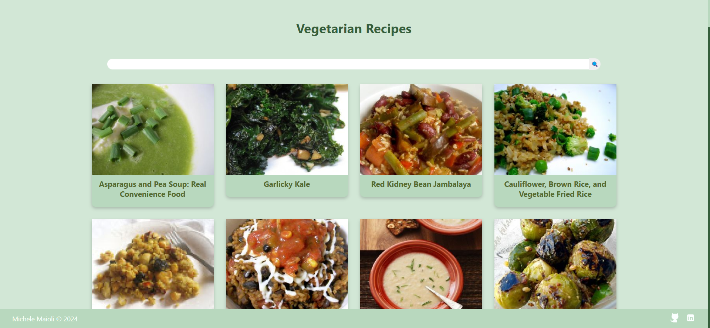

# Vegetarian Recipes

This application allows you to discover and search for vegetarian recipes using the [Spoonacular API](https://spoonacular.com/food-api/docs) service. [Try it here!](https://reactvegetarianrecipes.netlify.app/)

## Minimal Design

The design is user friendly, featuring a simple grid of cards that display the title, an image, and a link to the full recipe.

## Built With

- [JavaScript]()
- [HTML]()
- [CSS]()
- [Webpack]()
- [React]()

## Author

- [Linkedin](https://www.linkedin.com/in/michelemaioli)
- [Website](https://mic-9.github.io/)

## License

[MIT](https://choosealicense.com/licenses/mit/)
